Perfecto, te explico cada archivo y cómo trabajan juntos en tu monorepo:

## 1. `package.json` (Root - Raíz del monorepo)

```json
{
  "name": "microempresas-gt-platform",
  "version": "0.1.0",
  "private": true,  // ⚠️ No se publica a npm, es solo contenedor
  "scripts": {
    "build": "turbo run build",      // Compila TODOS los paquetes
    "dev": "turbo run dev",          // Modo desarrollo de TODOS
    "lint": "turbo run lint",        // Linter en TODOS
    "test": "turbo run test",        // Tests de TODOS
    "clean": "turbo run clean && rm -rf node_modules"
  },
  "devDependencies": {
    "turbo": "^2.0.0",              // Motor del monorepo
    "typescript": "^5.3.0"          // Compilador global
  },
  "packageManager": "pnpm@8.15.0",  // Fuerza usar pnpm
  "engines": {
    "node": ">=20.0.0",             // Versión mínima de Node
    "pnpm": ">=8.0.0"
  }
}
```

### ¿Qué hace este archivo?

Es el **orquestador principal** del monorepo. Cuando ejecutas:

```bash
pnpm build
```

Lo que realmente pasa:
1. Lee `turbo.json` para saber qué hacer
2. Busca todos los `package.json` en `/apps` y `/packages`
3. Ejecuta `pnpm build` en cada uno según el orden de dependencias
4. Usa cache para evitar recompilar lo que no cambió

**Analogía:** Es como el director de una orquesta que coordina a todos los músicos (paquetes).

---

## 2. `packages/core/package.json` (Paquete individual)

```json
{
  "name": "@yaestuvo/core",        // Nombre único en el monorepo
  "version": "0.1.0",
  "description": "Core domain entities, use cases, and repository interfaces",
  
  // 📦 Configuración de exportación
  "main": "dist/index.js",         // Archivo principal compilado
  "types": "dist/index.d.ts",      // Type definitions para TypeScript
  
  "scripts": {
    "build": "tsc",                // Compila TypeScript → JavaScript
    "lint": "eslint src --ext .ts",
    "test": "jest",                // Ejecuta tests unitarios
    "test:watch": "jest --watch",  // Modo watch para desarrollo
    "test:coverage": "jest --coverage"  // Con reporte de cobertura
  },
  
  "devDependencies": {
    "@types/jest": "^29.5.0",      // Types para Jest
    "@types/node": "^20.0.0",      // Types para Node.js
    "@yaestuvo/tsconfig": "workspace:*",  // ⚠️ Referencia interna
    "jest": "^29.5.0",
    "ts-jest": "^29.1.0",          // Permite ejecutar tests en TypeScript
    "typescript": "^5.0.0"
  },
  
  "dependencies": {
    "uuid": "^9.0.0"               // Dependencia de producción
  }
}
```

### ¿Qué hace este archivo?

Define un **paquete independiente** dentro del monorepo. Cuando ejecutas:

```bash
pnpm build --filter=@yaestuvo/core
```

Lo que pasa:
1. Turborepo lee este `package.json`
2. Ejecuta el script `"build": "tsc"`
3. TypeScript compila `src/**/*.ts` → `dist/**/*.js`
4. Genera archivos `.d.ts` para autocompletado

### Puntos clave:

#### `"main": "dist/index.js"`
Cuando otro paquete hace:
```typescript
import { Order } from '@yaestuvo/core';
```
Node.js busca el archivo en `dist/index.js`

#### `"types": "dist/index.d.ts"`
TypeScript busca las definiciones de tipos aquí para autocompletado en VS Code

#### `"workspace:*"`
```json
"@yaestuvo/tsconfig": "workspace:*"
```
Esto significa: "usa la versión que está en este monorepo, no la de npm"

---

## 3. `turbo.json` (Configuración de Turborepo)

```json
{
  "$schema": "https://turbo.build/schema.json",
  
  // Variables globales que invalidan cache
  "globalDependencies": ["**/.env.*local"],
  
  "tasks": {
    // 🏗️ TASK: build
    "build": {
      "dependsOn": ["^build"],           // ⚠️ Primero compila dependencias
      "outputs": ["dist/**", ".next/**", "build/**"]  // Cache estos directorios
    },
    
    // 🔍 TASK: lint
    "lint": {
      "dependsOn": ["^build"]            // Requiere que build esté listo
    },
    
    // 🧪 TASK: test
    "test": {
      "dependsOn": ["^build"],           // Requiere que build esté listo
      "outputs": ["coverage/**"]         // Cache reportes de cobertura
    },
    
    // 🔥 TASK: dev
    "dev": {
      "cache": false,                    // No cachear (siempre ejecutar)
      "persistent": true                 // Proceso que no termina
    },
    
    // 🧹 TASK: clean
    "clean": {
      "cache": false                     // No cachear limpieza
    }
  }
}
```

### ¿Qué hace este archivo?

Define **cómo y en qué orden** se ejecutan las tareas. Es el cerebro de Turborepo.

### Explicación detallada:

#### `"dependsOn": ["^build"]`

El símbolo `^` significa: **"dependencias upstream"**

Ejemplo práctico:

```
packages/core/          (no depende de nadie)
packages/adapters-db/   (depende de core)
apps/api-lambdas/       (depende de core y adapters-db)
```

Cuando ejecutas `pnpm build`:


Turborepo sabe el orden porque lee los `dependencies` en cada `package.json`

#### `"outputs": ["dist/**"]`

Turborepo cachea estos directorios. Si ejecutas `pnpm build` dos veces sin cambios:

```bash
# Primera vez
pnpm build
# ⏱️ Tarda 10 segundos

# Segunda vez (sin cambios)
pnpm build
# ⚡ Tarda 0.1 segundos (usa cache)
```

#### `"cache": false`

Para `dev` y `clean` no tiene sentido cachear porque:
- `dev`: Es un servidor que corre indefinidamente
- `clean`: Siempre debe borrar archivos

---

## Cómo trabajan juntos

### Escenario 1: Compilar solo el paquete core

```bash
pnpm build --filter=@yaestuvo/core
```

**Flujo:**
1. Turborepo lee `turbo.json` → encuentra task `"build"`
2. Ve `"dependsOn": ["^build"]` → verifica si core depende de otros paquetes
3. Core no depende de nadie → ejecuta directamente
4. Lee `packages/core/package.json` → ejecuta script `"build": "tsc"`
5. TypeScript compila `src/` → `dist/`
6. Turborepo cachea `dist/**` según `"outputs"`

### Escenario 2: Ejecutar tests

```bash
pnpm test --filter=@yaestuvo/core
```

**Flujo:**
1. Turborepo lee `turbo.json` → encuentra task `"test"`
2. Ve `"dependsOn": ["^build"]` → **primero debe compilar**
3. Ejecuta `pnpm build --filter=@yaestuvo/core` (si no está en cache)
4. Luego ejecuta `pnpm test` en core
5. Jest corre los tests usando el código compilado en `dist/`

### Escenario 3: Compilar todo el monorepo

```bash
pnpm build
```

**Flujo:**
1. Turborepo escanea todos los `package.json` en `/apps` y `/packages`
2. Construye un grafo de dependencias:

```
core (sin deps)
  ↓
adapters-db (depende de core)
  ↓
api-lambdas (depende de core + adapters-db)
```

3. Ejecuta en orden topológico (de abajo hacia arriba)
4. Usa paralelización cuando es posible

---

## Relación con tu pregunta original

Cuando el subagent ejecuta:

```bash
pnpm build --filter=@yaestuvo/core
pnpm test --filter=@yaestuvo/core
```

**Lo que realmente pasa:**

```mermaid
sequenceDiagram
    participant Dev as Developer
    participant Turbo as Turborepo
    participant Core as packages/core
    participant TS as TypeScript
    participant Jest as Jest

    Dev->>Turbo: pnpm build --filter=@yaestuvo/core
    Turbo->>Core: Lee package.json
    Core->>Turbo: Script "build": "tsc"
    Turbo->>TS: Ejecuta tsc
    TS->>TS: Compila src/*.ts → dist/*.js
    TS-->>Turbo: ✅ Build exitoso
    Turbo-->>Dev: ✅ Compilación completa
    
    Dev->>Turbo: pnpm test --filter=@yaestuvo/core
    Turbo->>Turbo: Verifica dependsOn: ["^build"]
    Turbo->>Turbo: Build ya está listo (cache)
    Turbo->>Core: Lee package.json
    Core->>Turbo: Script "test": "jest"
    Turbo->>Jest: Ejecuta jest
    Jest->>Jest: Corre *.test.ts
    Jest-->>Turbo: ❌ 1 test falló
    Turbo-->>Dev: ❌ Tests fallidos
```



**Si el test falla:**
- El build YA está hecho (archivos en `dist/`)
- Debes corregir el código
- Volver a compilar: `pnpm build --filter=@yaestuvo/core`
- Volver a testear: `pnpm test --filter=@yaestuvo/core`

---

## Resumen visual

```
┌─────────────────────────────────────────────────────────┐
│  ROOT package.json                                      │
│  ┌─────────────────────────────────────────────────┐   │
│  │ "build": "turbo run build"                      │   │
│  │ "test": "turbo run test"                        │   │
│  └─────────────────────────────────────────────────┘   │
│                        ↓                                │
│  ┌─────────────────────────────────────────────────┐   │
│  │ turbo.json                                      │   │
│  │ ┌─────────────────────────────────────────────┐ │   │
│  │ │ "build": { dependsOn: ["^build"] }          │ │   │
│  │ │ "test": { dependsOn: ["^build"] }           │ │   │
│  │ └─────────────────────────────────────────────┘ │   │
│  └─────────────────────────────────────────────────┘   │
│                        ↓                                │
│  ┌─────────────────────────────────────────────────┐   │
│  │ packages/core/package.json                      │   │
│  │ ┌─────────────────────────────────────────────┐ │   │
│  │ │ "build": "tsc"                              │ │   │
│  │ │ "test": "jest"                              │ │   │
│  │ └─────────────────────────────────────────────┘ │   │
│  └─────────────────────────────────────────────────┘   │
└─────────────────────────────────────────────────────────┘
```

¿Quieres que te explique alguna parte más a fondo o que te muestre cómo agregar scripts personalizados?
